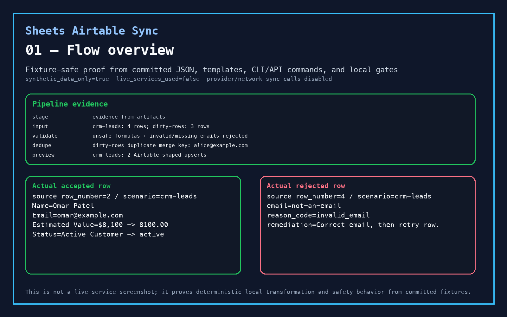
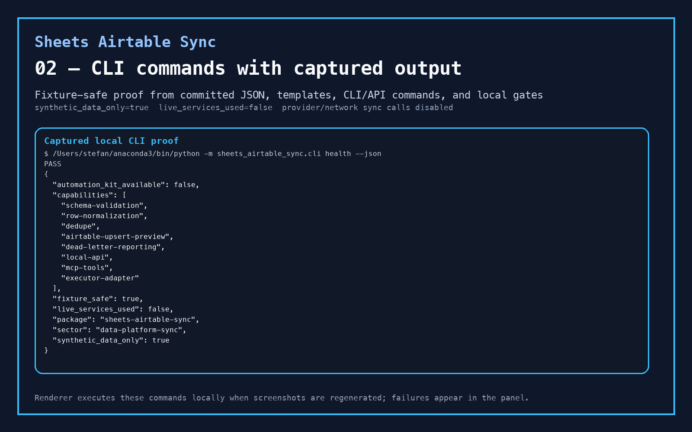
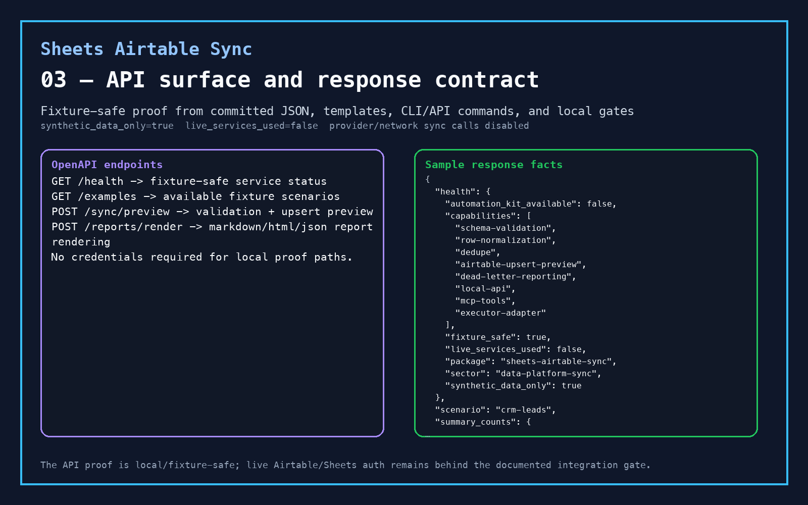
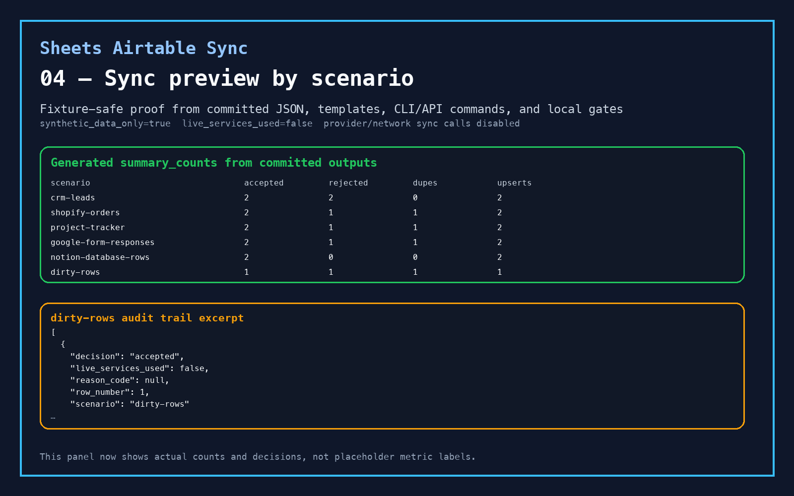
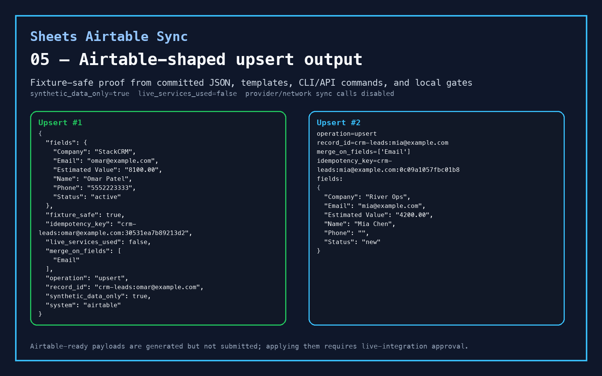
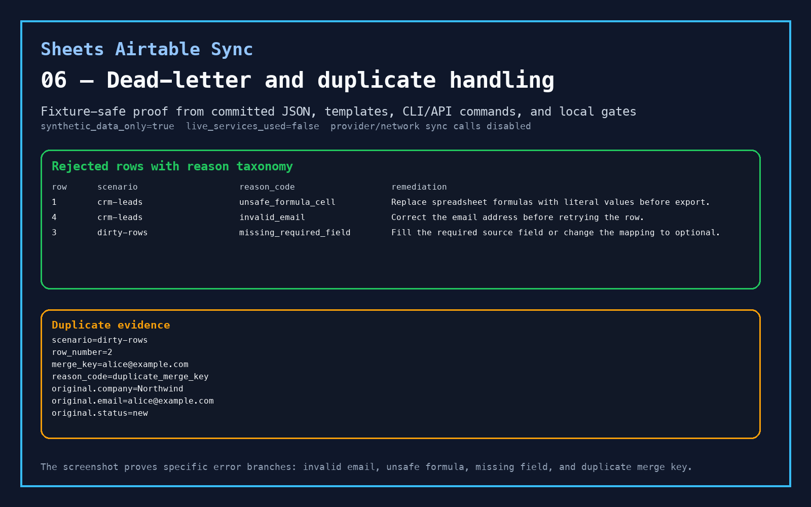
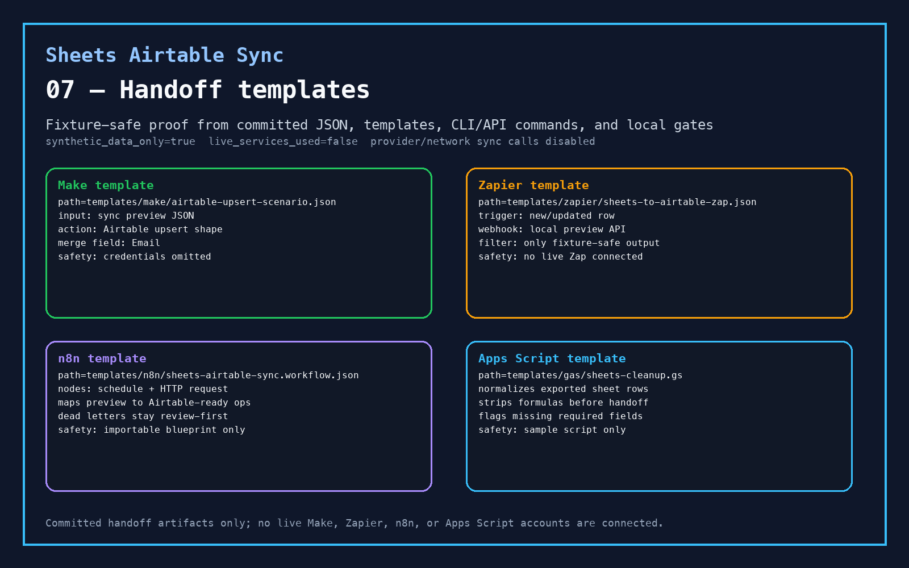
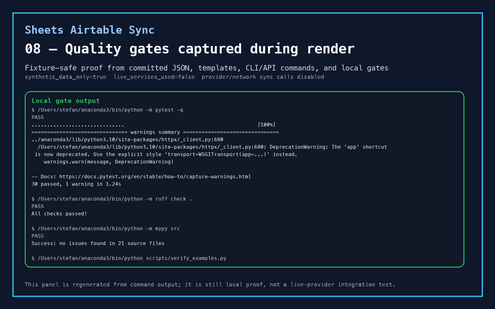

# Sheets Airtable Sync

Fixture-safe Google Sheets to Airtable sync proof for data-platform-sync workflows.

It shows how dirty spreadsheet/database rows become validated, normalized, deduped, Airtable-ready upsert previews with rejected-row/dead-letter output, client-readable reports, and agent-callable control surfaces.

## What it proves

- Buyer-shaped fixtures for CRM leads, Shopify orders, project trackers, Google Forms rows, and Notion-style rows.
- Config-driven field mapping and merge-key rules.
- Normalization for email, status, date, currency, boolean, phone, and multi-select fields.
- Duplicate detection, reason-code taxonomy, dead-letter remediation notes, and idempotency keys.
- CLI, FastAPI/OpenAPI, MCP tool functions, and `executor.sh` surfaces.
- Make, Zapier, n8n, and Google Apps Script handoff templates.
- Generated proof panels and deterministic reports.

## Safety boundary

Synthetic fixtures only. Empty credential placeholders only. No live Google Sheets, Airtable, CRM, Notion, Slack, Discord, Make, Zapier, n8n, cloud, payment, delivery, client data, or external submission side effects by default.

## Quick start

```bash
python -m venv .venv
source .venv/bin/activate
pip install -e ".[dev]"
PYTHONPATH=src python -m pytest -q
PYTHONPATH=src python -m sheets_airtable_sync.cli validate-examples
./executor.sh verify
```

## CLI

```bash
PYTHONPATH=src python -m sheets_airtable_sync.cli health --json
PYTHONPATH=src python -m sheets_airtable_sync.cli validate examples/input/crm-leads.json --mapping configs/mappings/leads-to-airtable.json
PYTHONPATH=src python -m sheets_airtable_sync.cli plan-upserts examples/input/crm-leads.json --mapping configs/mappings/leads-to-airtable.json
PYTHONPATH=src python -m sheets_airtable_sync.cli report examples/input/crm-leads.json --mapping configs/mappings/leads-to-airtable.json --format md --output examples/output/crm-leads-report.md
```

## Local API

```bash
PYTHONPATH=src python -m uvicorn sheets_airtable_sync.api:app --host 127.0.0.1 --port 8014
curl -fsS http://127.0.0.1:8014/health
curl -fsS -X POST http://127.0.0.1:8014/sync/preview \
  -H 'Content-Type: application/json' \
  --data @examples/api-requests/sync-preview-request.json
```

## Executor adapter

```bash
./executor.sh health
./executor.sh validate crm-leads
./executor.sh preview crm-leads
./executor.sh report crm-leads
./executor.sh api-smoke
./executor.sh verify
```

## Evidence package

















More evidence:

- `docs/architecture.md`
- `docs/api.md`
- `docs/mcp.md`
- `docs/executor.md`
- `docs/platform-handoff.md`
- `docs/live-integration-gate.md`
- `docs/case-study.md`
- `docs/evidence.md`
- `docs/public-readiness-checklist.md`

## Live integration gate

Live Google Sheets and Airtable work is intentionally stubbed. See `docs/live-integration-gate.md` for auth scopes, rate-limit handling, Airtable `performUpsert.mergeOnFields`, webhook caveats, and sandbox approval requirements.

## License

MIT.
